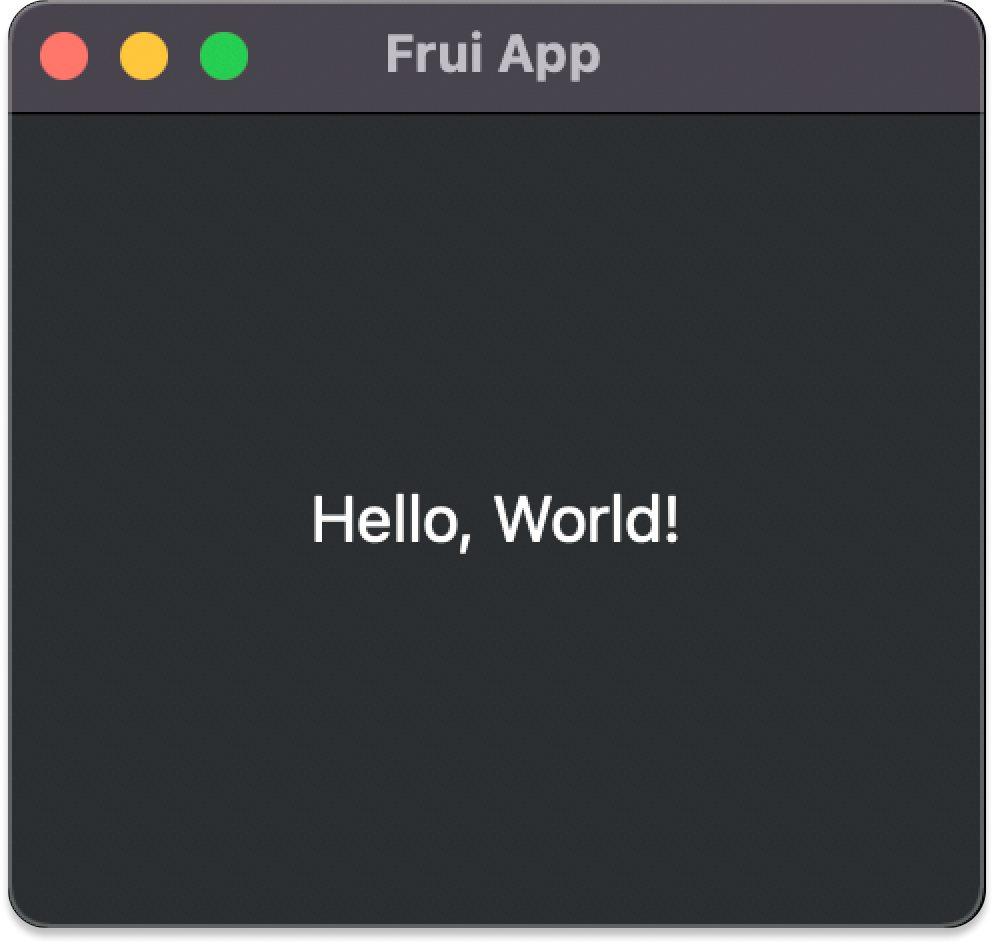
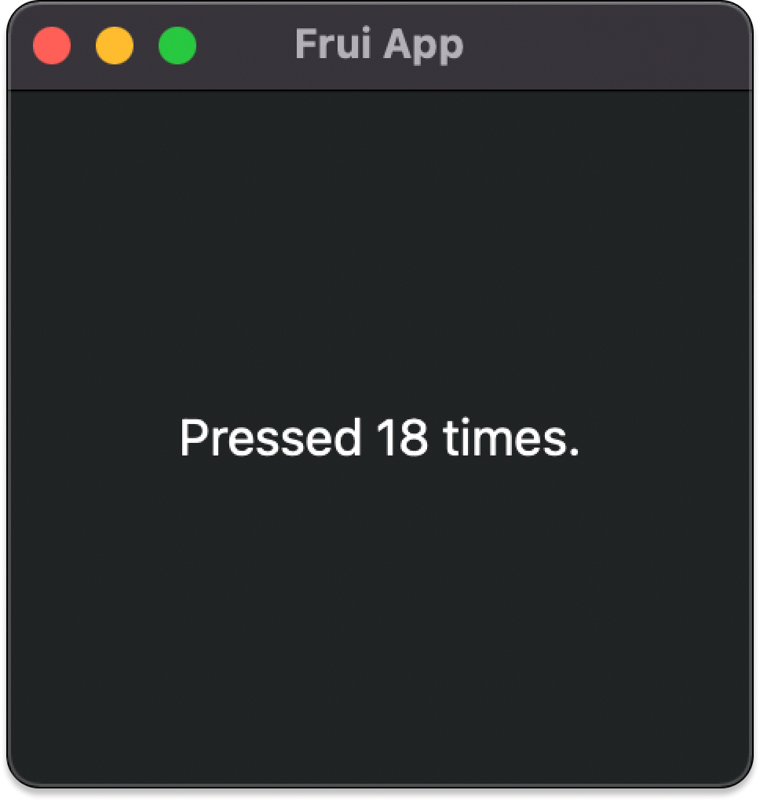

#  blog

##### A developer-friendly framework for building user interfaces in Rust.


# Frui 0.0.1

*October 14, 2022, posted by [iglak](https://github.com/toiglak)*

Hi, I'm iglak. In this post, I want to introduce you to the very first version of [Frui](https://github.com/fruiframework/frui) - a developer-friendly framework for building user interfaces in Rust. Here, I will explain its basic architecture and talk about what motivated Frui and its design choices in the first place. Finally, I'll show you the current state of the features and what's next.

<p align="center">

</p>

<p align="center">Crab counter made in Frui 
<a href="https://github.com/fruiframework/frui/blob/fe96a1752e314c8c7a4f287ce98a2a7f81c298fd/examples/crab_counter.rs">(see the code)</a>
</p>

*Author's note: this is my first blog post ever and in my second language at that, so please tell me if something could be improved :) Frui is a framework inspired by Flutter. Because of that, those who are familiar with Flutter should be able to grasp concepts in this post intuitively.*

## Frui app

Let's start with the simplest application you can run. 

```rust
use frui::prelude::*;

fn main() {
    run_app(());
}
```

With that our first Frui application is ready! It obviously does nothing (apart from opening an empty window), but let's explain what happens. run_app is a function that starts up the framework, and as an argument it takes a widget to display. In this case that widget is unit type `()` which renders nothing.
You can compose widgets together to build more complicated UIs:

```rust
fn main() {
    run_app(Center::child(Text::new("Hello, World!")));
}
```
 
Here we wrap Text widget in Center widget. After we run this is what we will see:


<p align="center">

</p>
 
Composing widgets in this way makes it possible to write complicated UIs while keeping them simple and easy to understand.

### View widget

For an application to be scalable there must be a way to abstract parts of the UI interface. In Frui this can be done using `ViewWidget`:

```rust
#[derive(ViewWidget)]
struct HelloWorld;

impl ViewWidget for HelloWorld {
    fn build<'w>(&'w self, _: BuildContext<'w, Self>) -> Self::Widget<'w> {
        Center::child(Text::new("Hello, World!"))
    }
}

fn main() {
    run_app(HelloWorld);
}
```

In the above code, the previous UI fragment is put inside of the `HelloWorld`’s `ViewWidget` implementation. That way you can now use that same piece of interface in multiple places by referencing the `HelloWorld` widget.

Do note that the above code uses some of the **Rust nightly** features to work, so for the above to compile you will need to add the following two lines to your crate root.

```rust
#![feature(min_specialization)]
#![feature(type_alias_impl_trait)]
```

Last important thing I want to introduce is `WidgetState`:

```rust
impl WidgetState for HelloWorld {
    type State = usize;

    fn create_state(&self) -> Self::State { 0 }
}
```

By implementing above, the `HelloWorld` widget can now hold state. With that we can make use of the `BuildContext` argument passed to the `build` method:

```rust
impl ViewWidget for HelloWorld {
    fn build<'w>(&'w self, ctx: BuildContext<'w, Self>) -> Self::Widget<'w> {
        KeyboardEventDetector {
            on_event: |_| *ctx.state_mut() += 1,
            child: Center::child(
                Text::new(format!("Pressed {} times.", *ctx.state()))
            ),
        }
    }
}
```

`KeyboardEventDetector` is a widget, which calls `on_event` callback every time a key is pressed. Additionally in the child field of that widget we placed our previous hello world code.

Inside of that callback we increment the state of our widget (accessed through `state_mut`) and in response to that Frui rebuilds `HelloWorld` widget, thus updating the UI.
With that we get the following:

<p align="center">

</p>


Full code:

```rust
#![feature(type_alias_impl_trait)]
#![feature(min_specialization)]

use frui::prelude::*;

#[derive(ViewWidget)]
struct HelloWorld;

impl WidgetState for HelloWorld {
    type State = usize;

    fn create_state(&self) -> Self::State { 0 }
}

impl ViewWidget for HelloWorld {
    fn build<'w>(&'w self, ctx: BuildContext<'w, Self>) -> Self::Widget<'w> {
        KeyboardEventDetector {
            on_event: |_| *ctx.state_mut() += 1,
            child: Center::child(
                Text::new(format!("Pressed {} times.", *ctx.state()))),
        }
    }
}

fn main() {
    run_app(HelloWorld);
}
```
 
As a side note, `WidgetState` has more methods that can be implemented, e.g. `mount` and `unmount`. This is directly inspired by Flutter.
 
## Frui goals

Since the beginning, the main goal of Frui was to make a simple and extensible API. One that is both easy to implement and refactor. Frui reasons that a productive developer means better software. And that is exactly the goal: **to enable developers to write UI code efficiently and avoid typical pain points of other libraries**.

This goal already dictated some of the design decisions, like:

- allow data to be passed from parent to child widget through simple references (widgets can be non-static) and allow widgets to be generic (this allows children widgets to be inlined)
- avoid macros where possible, so that tools like rust-analyzer can work well
- automatically infer return type of the build method, to avoid manually type erasing return value or manually writing [TAIT](https://github.com/rust-lang/rust/issues/63063) inside of the associated type
- use builder pattern to avoid `..Default::default()` when using the core widgets
- iterate on the API before releasing and study what worked and what didn’t in other ui frameworks
- use Rust with its awesome features (algebraic types, pattern matching, traits, crates, etc.)

One consequence of that goal is that Frui doesn’t aim to be the most efficient UI library in Rust. Of course it doesn’t mean that Frui doesn’t care about performance at all, but compared to other libraries Frui aims to be more high-level, where the main focus is put on simplicity, intuitiveness, and maintainability.
 
## Interesting bits

### Generic widgets

Even though the preferred way of constructing widgets in Frui is using the builder pattern, which one could assume means boxing and erasing the type of those widgets in builder methods, widgets in Frui can be fully generic and the state of such widgets is preserved between rebuilds.

Thanks to that, some builder methods in Frui tend to look like this:

```rust
impl<W: Widget> Container<W> {
    pub fn child<C: Widget>(self, child: C) -> Container<C> { ... }
}
```

<details>

<summary>Example use of such API</summary>
    
In the following example you can similar builder method in action: 

1. `Column::builder()` returns `Column<()>` type.
2. Column is then configured with different methods.
3. Finally, `children` builder method updates the children list in the column, turning the type of the column into `Column<(Square, Square, Square)>`.

Throughout all of this, the column widget remains generic and no children are boxed.

```rust
#[derive(ViewWidget)]
struct App;
 
impl ViewWidget for App {
    fn build<'w>(&'w self, _: BuildContext<'w, Self>) -> Self::Widget<'w> {
        Column::builder()
            .space_between(10.0)
            .main_axis_size(MainAxisSize::Max)
            .cross_axis_size(CrossAxisSize::Max)
            .main_axis_alignment(MainAxisAlignment::SpaceEvenly)
            .cross_axis_alignment(CrossAxisAlignment::Center)
            .children((
                Square(Color::rgb8(13, 245, 152)),
                Square(Color::rgb8(255, 0, 110)),
                Square(Color::rgb8(0, 186, 255)),
            ))
    }
}
```

</details>

<details>

<summary>Why it matters </summary>

It’s about preserving the state of widgets. 

Let’s show this in an example. Say there's a `Parent` widget and a generic `Child` widget that has state `S`. When `Parent` widget builds `Child<TextWidget>`, the state `S` of that widget is initialized:

```
Parent —> Child<TextWidget> (S)
```

Let's say that after a `Parent` widget rebuilds, it will return the same `Child` widget but with a different generic type (this often happens when the child of a generic widget is changed).

```
* Parent rebuilds *
Parent —> Child<()> (S)
```

In the above simple scenario, even though `TypeId`s of `Child<TextWidget>` and `Child<()>` are different, the state `S` of the `Child` widget is preserved.

You can see this in action in the [`preserve_state.rs` example](https://github.com/fruiframework/frui/blob/fe96a1752e314c8c7a4f287ce98a2a7f81c298fd/examples/preserve_state.rs).

</details>

### Non-static widgets

Frui makes it possible to have non-static widgets. This eliminates the need for reference counting and makes it easy to pass data from `self` to child widget!

```rust
#[derive(ViewWidget)]
struct App<'a> {
    text: &'a str,
}
 
impl ViewWidget for App<'_> {
    fn build<'w>(&'w self, _: BuildContext<'w, Self>) -> Self::Widget<'w> {
        Center::child(Text::new(&self.text))
    }
}
```

This is often used to pass a reference to a child stored in a struct field:

```rust
#[derive(ViewWidget)]
struct App<W: Widget> {
    child: W, // W doesn't require 'static bound!
}
 
impl<W: Widget> ViewWidget for App<W> {
    fn build<'w>(&'w self, _: BuildContext<'w, Self>) -> Self::Widget<'w> {
        Center::child(&self.child)
    }
}
 
run_app(App {
    child: Text::new("Hello!"),
});
```

### More interesting bits
There are a few more things in Frui that you may find interesting! Check out the following examples, which come with explanations:

- [local key example](https://github.com/fruiframework/frui/blob/fe96a1752e314c8c7a4f287ce98a2a7f81c298fd/examples/local_key.rs) - preserving state of children widgets in multi-child widgets (related to “stable widget identity”),
- [inherited widget example](https://github.com/fruiframework/frui/blob/fe96a1752e314c8c7a4f287ce98a2a7f81c298fd/examples/inherited_widget.rs) - how to define and use an inherited widget which allows for (1) accessing common state from any place in that widget’s subtree and (2) rebuilding only those widgets which depend on it,
- [column](https://github.com/fruiframework/frui/blob/fe96a1752e314c8c7a4f287ce98a2a7f81c298fd/examples/column.rs) and [row](https://github.com/fruiframework/frui/blob/fe96a1752e314c8c7a4f287ce98a2a7f81c298fd/examples/row.rs) [examples](https://github.com/fruiframework/frui/tree/fe96a1752e314c8c7a4f287ce98a2a7f81c298fd/examples) - how different options of those widgets affect the way their children are laid out,
- [crab counter example!](https://github.com/fruiframework/frui/blob/fe96a1752e314c8c7a4f287ce98a2a7f81c298fd/examples/crab_counter.rs) - get a taste of how *fun* building “real applications'' in Frui could be

## Future

### Backend

The back-end of the Frui needs a lot of work. It was basically made as a proof of concept, so that I could focus on building the API.

There is still a lot to do, for example implementing event handling correctly so it is aware of z-index (widgets in front of other widgets) and making it in such a way that won't make it hard to implement focus and accessibility features later on. Another important thing that needs to be implemented in the back-end are various optimizations of layout and paint algorithms. The API for event handling, layout, and painting can still be experimented with and I hope to find something that will work very well and will scale up to large applications.

### More widgets

Frui has only a handful of widgets right now. Apart from implementing more of them, the goal is to have two kinds of widgets:

- a set of core widgets that are common across different design languages (like columns, rows, and containers),
- and a second set of widgets specifically for building apps according to a particular design language (like Material Design).

Many of these widgets can be adapted from Flutter, which has a similar structure to Frui. That way we can also figure out what works and doesn't work, so we end up with an even better API in the end.

### Async

Rust is a great fit for asynchronous programming because of its features and ecosystem. I think that async should be a core part of any UI framework and because of that, they should be integrated to work well together. 

In the future, I want writing asynchronous code in Frui to be as simple as:

```rust
#[derive(ViewWidget)]
struct PageContent<'a> {
    link: &'a str,
}
 
impl ViewWidget for PageContent<'_> {
    fn build<'w>(&'w self, ctx: BuildContext<'w, Self>) -> Self::Widget<'w> {
        let res = ctx.spawn_future(async {
            let body = reqwest::get(self.link).await?;
            body.text().await
        });
 
        match res {
            Poll::Pending => LoadingCircle().boxed(),
            Poll::Ready(Ok(s)) => SuccessWidget(s).boxed(),
            Poll::Ready(Err(e)) => ErrorWidget(e).boxed(),
        }
    }
}
```

### Better resource bundling

I was thinking about how to utilize Rust's module system and macros to improve the way assets are typically handled. Existing solutions feel wonky or prone to errors, so I wanted to see if there was a better way.

The idea is to create a macro that would work similarly to `include!`. It would issue a compile time error immediately when the path to an asset is incorrect. When compiling for release, it would put and link those resources in a separate asset bundle to not bloat the executable.

Module system would then be used to organize those imports in the code.

Say we have following structure of the assets directory:

```rust
// /assets
// \_ /brand
//   \_ brand-logo.png
//   \_ mod.rs
// \_ mod.rs
```

In `assets/brand/mod.rs` we would define:

```rust
const BRAND_LOGO: Asset = include_asset!("brand-logo.png");
```

And then to import it we would simply write:

```rust
#[derive(ViewWidget)]
struct App;
 
impl ViewWidget for App {
    fn build<'w>(&'w self, ctx: BuildContext<'w, Self>) -> Self::Widget<'w> {
        Image::new(assets::brand::BRAND_LOGO)
    }
}
```

Again, this is all just me daydreaming, but I think doing it that way provides a lot of benefits over the existing solutions. I imagine that refactoring code like this would be much easier and it would be much harder to mess things up.

## Finishing thoughts

I began working on Frui after having experienced the fun of putting together different lego blocks of an UI in Flutter and wanted to capture that same feeling in Rust. I think Frui succeeded in capturing that joy! 

Still, if Frui is to become something more than just a prototype a lot of work is needed. Currently the biggest limiting factor for Frui’s growth is my little understanding of things related to backend (especially the things I [mentioned before](#future)). I decided to release Frui in its current state with hope that I will be able to reach people that can help bringing Frui’s vision to life. If you feel like you know one thing or two about UI frameworks [please reach out](https://github.com/fruiframework/frui)!

I hope you could find something interesting in this blog post. Frui is an ambitious project but I am sure it will bring some interesting ideas to Rust. Thank you for reading and I hope to see you soon on [Frui's github page](https://github.com/fruiframework/frui)!
